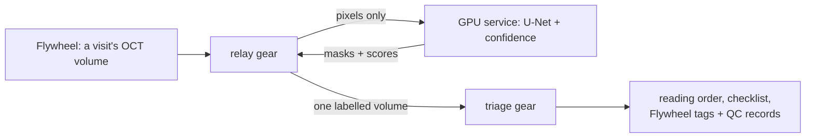
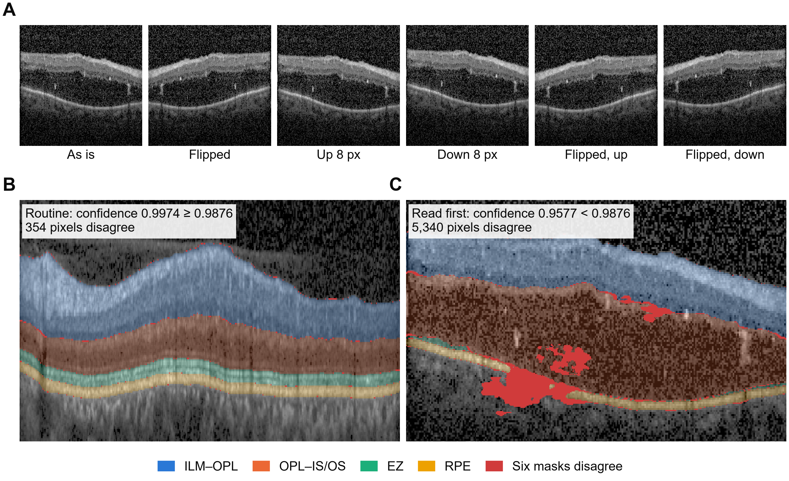
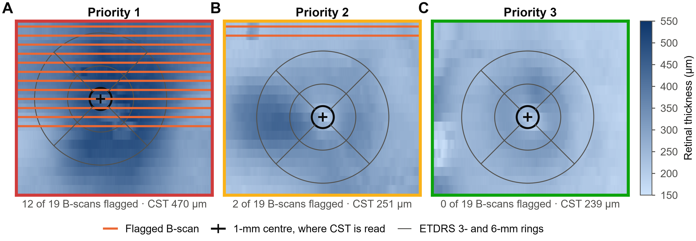
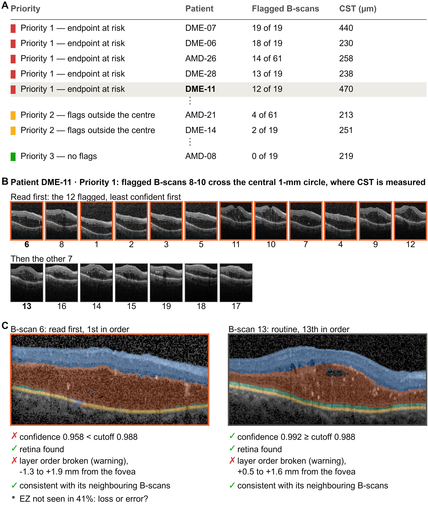
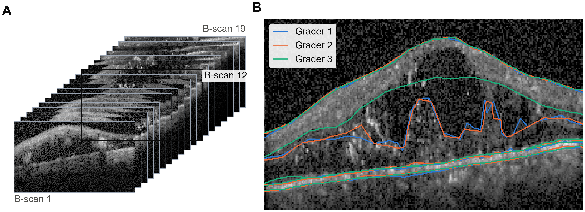
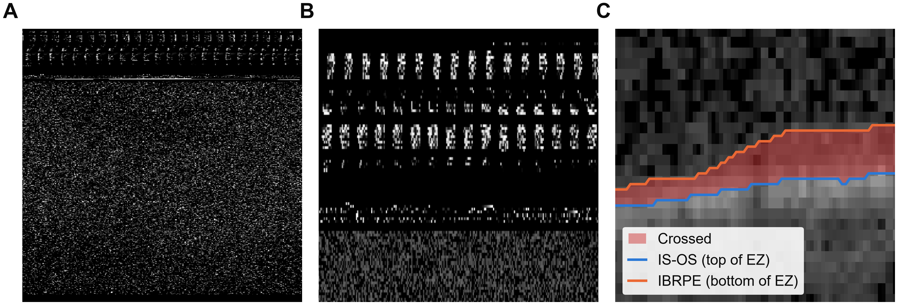
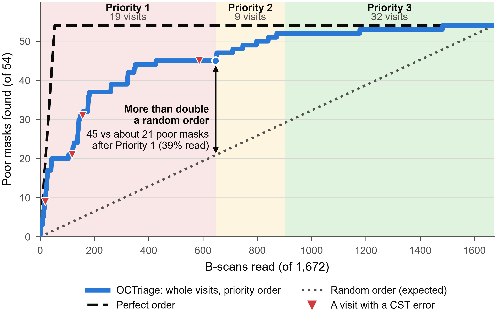

# OCTriage: which OCT segmentations should graders read first?

**Start here:** the [poster (PDF)](docs/OCTriage_poster.pdf) gives the whole study on one page; the [report (PDF)](docs/OCTriage_report.pdf) tells it in 13 pages. This README is the technical companion: how it works, what is where, how to run it, and where each decision comes from.

## What it does

At the Wisconsin Reading Center (WRC), AI does the preliminary work and graders review it
([A-EYE update 2025](#sources); [SIIM 2026](#sources)), yet most AI masks need no or only minor
edits (84.8% in [Bogost et al. 2025](#sources), where graders reviewed every mask). Readers also
tire: after a day of reading, radiologists found fractures less accurately ([Krupinski 2010](#sources)).
**OCTriage** puts the segmentations most likely to need edits first, each with its reason, so
graders meet the likely errors while they are fresh. Every scan is still read; only the order
changes.



- **relay** (a Flywheel gear, one job per visit) sends each B-scan to a GPU model service and
  stores every mask, confidence and measurement in one labelled volume. It holds no model.
- **triage** (a Flywheel gear) flags B-scans, gives the visit a priority, and writes the reading
  order, a checklist per B-scan, a tag (`triage-priority1/2/3`) and Flywheel QC records. It holds
  no model either.
- **GPU service**: a U-Net ([Ronneberger 2015](#sources); the U-Net/FPN family was best of 12 in
  [Safai 2024](#sources)) trained for this study with 5-fold cross-validation by patient, plus a
  confidence score from six shifted or flipped copies of each B-scan. It agrees with the graders as
  well as they agree with each other (mean Dice **0.917** vs **0.914**). Any model that returns a
  mask and a confidence can replace it, WRC's nnSAM included; `analysis/gate_analysis.py` then
  derives its cutoff.

Why a separate GPU service: Flywheel runs gears without GPUs unless GPU compute is added to a site
([Flywheel docs](#sources)), and a service keeps the model loaded, so a B-scan costs about 0.17 s on
an RTX 2060 instead of a container start and a model load. relay lets a gear use a GPU machine
outside Flywheel, such as WRC's GPUs inside UW; whether a Flywheel job can reach them is untested.

When something goes wrong: relay checks the input and the service's `/health` before sending
anything, tries a dropped connection or a server error twice more (2 s, then 4 s), never retries a
refused request (4xx), sends pixels only, and otherwise fails with one log line, writing and tagging
nothing. triage refuses answers from any model other than the one its cutoff was chosen for
(`cutoff_model`), because another model's scores need their own cutoff.

## How triage decides



**Each B-scan.** It goes to the routine queue if its confidence is **≥ 0.98760** and the model finds
retina in ≥ 90% of its columns; otherwise it is read first, and the reason is written on the file.
The cutoff is Youden's index ([Youden 1950](#sources)): the best balance between poor masks caught
and acceptable masks flagged. In testing, each fold's cutoff came from the other four folds.

**Each visit.** Priority 1 = a flagged B-scan crosses the central 1-mm circle where central subfield
thickness (CST) is read, or the scan is off-centre; Priority 2 = flagged B-scans elsewhere;
Priority 3 = nothing flagged. CST steers trials: in a major DME drug trial (DRCR Protocol T), OCT
thickness helped decide who could join, and a 10% CST change counted as better or worse when
deciding whether an eye got another injection ([Wells 2015](#sources)). The three priorities are
**ours**, built from referenced pieces (see "Where each decision comes from" below).



**The reading order.** Visits by priority; inside a visit, hard failures (no retina) first, then the
least confident; then the routine images, least confident first. It is a fixed order, not a
weighted score: 54 poor masks are too few to fit weights. Layer-order and neighbouring-B-scan
checks appear on the checklist as warnings; they never change a verdict or a priority.

**What a grader would see in Flywheel** (drawn from the gears' real outputs, not a screenshot). On
trial data the gear would also check image quality and change since the last visit (longitudinal
consistency, [Bogost 2025](#sources)); OCT5k has no quality grades and one visit per patient, so
neither check could be tested here.



<details>
<summary><b>The checklist and the Flywheel QC records for patient DME-11</b></summary>

`DME11_triage.txt`, from a local `flyw gear run`, trimmed:

```
DME11 · priority 1 · 12 of 19 images to read first
Priority 1: flagged B-scans 8-10 cross the central 1-mm circle, where CST is measured
CST 470 µm, EZ-loss area 8.88 mm²
– image quality not assessed: no validated gradability model (needs WRC's quality grades)
Reading order: 6, 8, 1, 2, 3, 5, 11, 10, 7, 4, 9, 12, 13, 16, 14, 15, 19, 18, 17

Image 6 (read first)
  ✗ confidence 0.957738 < cutoff 0.987604
  ✓ retina found in 100% of columns
  ✗ layer order broken by ≥ 20.1 µm in 33 columns, -1.3 to +1.9 mm from the fovea along the B-scan (signal)
  • EZ not seen in 41% of the retina columns: EZ loss or a segmentation error; check
```

What Flywheel stores on `DME11_relay.nrrd` (`.metadata.json`, trimmed):

```json
"tags": ["triage-priority1"],
"info": {"qc": {"triage": {
  "triage":        {"state": "FAIL", "priority": 1, "why": "Priority 1: flagged B-scans 8-10 cross the central 1-mm circle, where CST is measured",
                    "read_first": [6, 8, 1, 2, 3, 5, 11, 10, 7, 4, 9, 12], "cst_um": 470.1, "ez_loss_mm2": 8.88, "...": "..."},
  "confidence":    {"state": "FAIL", "below_cutoff": [6, 8, 1, 2, 3, 5, 11, 10, 7, 4, 9, 12], "cutoff": 0.9876041522850904},
  "retina":        {"state": "PASS", "no_retina": []},
  "layer_order":   {"state": "FAIL", "images": [6, 8, 2, 3, 11, 10, 7, 9, 12, 13], "note": "signal only (breaks >= 20.1 µm): changes no verdict or priority"},
  "continuity":    {"state": "PASS", "assessed": true, "flagged_bscans": []},
  "image_quality": {"state": "NA", "reason": "no validated gradability model (needs WRC's quality grades to build and test)"},
  "longitudinal":  {"state": "NA", "reason": "no previous visit to compare with (design: Bogost et al. 2025)"}}}}
```
A reading queue can filter on the tag and sort on the reading order. The QC records are Flywheel's
own convention (`add_qc_result`), so a site can search on any field.

</details>

<details>
<summary><b>Every check, and what was built</b></summary>

Every check returns a Flywheel QC record (`add_qc_result`: pass / fail / **na**). When a check can't
run, it says why. A check decides the reading order only if it catches more poor masks at the same
number of reads; otherwise it is a warning on the checklist (the code calls it a signal).

| Check | Role | Status | Source | QC record |
|---|---|---|---|---|
| Confidence: agreement of 6 flipped/shifted copies | decides | **built**; beats two published scores | WRC 2022 method; Wang 2019; the 6-copy score is **ours** | `confidence` |
| Retina in ≥ 90% of image columns | decides; read before all others | **built** | **ours**: a stable model can confidently find no retina | `retina` |
| Image quality (gradability) | warning | **needs data**: no quality grades in OCT5k | SCORE Report 4 scale; vendor indices are weak (Holmen 2020, OCT angiography: specificity 37–41%) | `image_quality`: na |
| Layer order (anatomy) | warning | **tested, not adopted**: flags 54% of B-scans, mostly stray pixels; the warning counts only breaks ≥ 20.1 µm | He 2019; 20.1 µm = CST repeatability (Domalpally 2010) | `layer_order` |
| Continuity with neighbouring B-scans | warning | **tested, not adopted**: 5 vs 4 poor masks left at equal workload | Garvin 2009 (limits learned from the graders) | `continuity` |
| EZ not seen over ≥ 5% of a B-scan | finding | **built**: EZ loss is disease and a trial endpoint, or a segmentation error; the grader decides | Encelto (EZ-loss endpoint); the 5% is **ours** | a checklist line |
| Visit endpoints: CST, EZ-loss area | priority | **built** | Pak 2013 (thickness, grid) | `triage` |
| Off-centre scan > 200 µm | priority | **built**; measurable in only 10 of 60 volumes (sparse B-scans) | Pak 2013; Domalpally 2009 | `triage` |
| Change since the last visit | warning | **needs data**: one visit per patient | Bogost 2025 | `longitudinal`: na |

</details>

## Data

[OCT5k](#sources) (CC0): Spectralis B-scans, each traced by three graders (5 boundaries per B-scan),
one visit per patient; the images come from [Rasti et al. 2018](#sources). OCT5k stores each B-scan
as its own image; `data_prep/pack_volume.py` stacks a patient's B-scans in order into one volume,
spaced by the paper's 8.9 × 7.4 mm scan.

| Cohort | Patients | B-scans | Graders agree, median Dice | B-scans with crossing boundaries | Poor model masks |
|---|---|---|---|---|---|
| AMD | 21 | 739 | 0.918 | 34 | 21 |
| DME | 19 | 403 | 0.913 | 79 | 24 |
| Normal | 20 | 530 | 0.934 | 19 | 9 |
| **All** | **60** | **1,672** | 0.922 | 132 | 54 |



Looking at the data found what a metric would not show: noise frames that were traced anyway,
device text burned into images, and boundaries drawn out of order (kept, and flagged in the
manifest). `data_prep/build_manifest.py` joins every mask to its image and writes nothing if a
single file is missing or does not match.



## Results

Every B-scan was scored by the fold model that never saw its patient. To score the flags we need an
answer key: a mask is **poor** if the model agrees with the graders at least 0.05 Dice less than the
graders agree with each other. The size is **ours**, but the graders back it: judged the same way, a
grader falls more than 0.044 Dice below the other two in only 5% of gradings, and a failure
threshold is best set where inter-annotator variability is known ([Zenk 2024](#sources)).



| What | Result |
|---|---|
| Priority 1 read: 39% of B-scans (19 of 60 visits) | 45 of 54 poor masks and all 4 CST errors; a random order finds about 21 |
| Priorities 1–2 read: 54% of B-scans | 52 of 54 poor masks |
| Flagged to read first | **8.8%** of B-scans |
| Poor masks inside the flagged B-scans | **49 of 54: 91%**; 33% of flagged masks are poor, against 3.2% overall |
| Poor masks among the rest | 0.33%, 5 of 1,525 |
| Other definitions of poor: the graders' own margin (0.044) / the strict end of WRC's ±20–30 µm thresholds ([SIIM 2026](#sources)) | 56 of 66 (85%) / 44 of 55 (80%) inside the flagged B-scans |

- **Flags alone**, ignoring visits: 49 of 54 poor masks in the first 8.8% read, all 54 after 43%.
- **Why flagged:** 145 for low confidence, 2 for low confidence and no retina. The retina check
  added no flag of its own here; it guards against a model that is stable but wrong (a
  random-weight U-Net scored confidence 1.0 while finding no retina).
- **Where the graders disagree, the gate flags:** confidence vs inter-grader agreement, Spearman 0.50.
- **By cohort:** 20% of DME B-scans are flagged (all 24 poor DME masks are among them), 6.5% of AMD,
  3.4% of Normal.
- **Against published confidence scores** (rule written before scoring:
  [`analysis/prereg/a0_confidence.md`](analysis/prereg/a0_confidence.md)): flagging the least
  confident 8.8%, ours leaves 4 of the 54 poor masks in the routine queue, single-pass entropy
  ([Zenk 2024](#sources)) 18, test-time volume variation ([Wang 2019](#sources)) 8. Ours also has
  the lowest AURC.
- **Checks tested and not adopted** (rules written first:
  [`analysis/prereg/phase_a.md`](analysis/prereg/phase_a.md)): layer order flags 54% of B-scans,
  mostly for stray pixels; the neighbouring-B-scan check left 5 poor masks where confidence alone
  left 4 at the same workload. Both stay on the checklist as warnings.
- **Visit endpoints:** the model's CST is within the 20.1 µm repeatability of the graders'
  ([Domalpally 2010](#sources)) in 56 of 60 visits; EZ-loss area is weaker (ICC 0.97 among graders,
  0.72 with the model added), because the model under-reads EZ loss in DME.

## How it could fit at WRC, and grow

Both gears would run at ingest, after WRC's Orchestra-Gear tags a site's upload and before
`SitetoDQE.py` moves it into a review project and creates tasks; that placement is my reading of
WRC's public code, not confirmed with WRC. The GPU service would run WRC's own model on WRC's GPUs,
with its cutoff set on WRC's graded data.

OCTriage changes the order of reading, not the amount. It would first need watching: every grader
edit logged against the gate's verdict and confidence, per trial, site, grader and month, with
regrades to catch drift, as WRC's SCORE Report 9 did ([Blodi 2010](#sources)). If the routine queue
stayed clean across trials, a trial's charter might one day check it by sample instead of reading
all of it, which would cut the graders' workload; the FDA's nonbinding 2018 imaging guidance
suggests verifying a subset of computer-generated analyses (p.25), under criteria fixed in advance
(p.27). That decision belongs to WRC and the sponsor.

## Limits

- **Never run on a live Flywheel site** (no access). Both gears run locally under `flyw gear run`,
  the same container contract; rule triggering and engine-applied tags are untested. Whether a
  reader task's order can come from our tags is a question for WRC.
- **One public dataset**: 60 patients, one visit each, one device, not trial data. Its graders
  corrected AI-drawn masks, so their agreement is tighter than it would be for independent tracings.
  relay takes an NRRD volume; a DICOM/E2E converter is not built.
- **One model**, a U-Net trained once. DME is its weak spot (it under-reads EZ loss).
- **Confidence measures stability, not correctness**, hence the retina check. The 4 noise frames in
  OCT5k count as errors in the headline; results without them are in `results.json`.
- **Geometry** comes from the OCT5k paper (±10% on µm); the gear reads real spacing from the volume
  header. The fovea is found as the thinnest point, which fails in thick DME.
- **Slurm files** ran on a single-node Slurm 23.11 + Apptainer 1.5.4 bench (service image 0.5.0), not
  on UW's Platform R.
- **No encryption or login** on the demo service yet: on a real network it would sit behind HTTPS
  with a key, inside UW.

## What is where

```
flywheel_gears/   runs inside Flywheel
  relay/          gear 1: a visit's B-scans -> GPU service -> masks + confidence
  triage/         gear 2: flags, priorities, reading order, checklist, tags, QC records
  run_locally/    both gears under Flywheel's own `flyw gear run`, on real visits
gpu_service/      runs on the GPU machine
  app.py, tta.py  the model service and its confidence score
  unet/           the U-Net and its training (one YAML config)
  slurm/          the same Docker image as Slurm jobs: train, score, serve
oct_checks/       the OCT rules triage runs; the analysis imports the same code
analysis/         does it work? each rule written down, in analysis/prereg/, before its result
data_prep/        joins OCT5k's masks to their images; packs a visit into one volume
docs/             the poster, the report and the figures (docs/figures.py draws them)
tests/            tests on small fake data; they run anywhere
```

The rule files in `analysis/prereg/` were frozen (their hashes are checked) before the folders got
their current names: where they say `model/`, `service/`, `prep/` or `triage/`, read
`gpu_service/unet/`, `gpu_service/`, `data_prep/` and `flywheel_gears/triage/`.

## Run it

**1. Tests** (CPU, no dataset needed)
```bash
pip install -r requirements.txt   # torch CPU build: see the file's header
pytest -q
```

**2. Both gears, as Flywheel runs them, on your machine** (Docker + the [Flywheel CLI](https://docs.flywheel.io); no account)
```bash
docker build -t local/relay:0.2.1 flywheel_gears/relay/
docker build -f flywheel_gears/triage/Dockerfile -t local/triage:0.2.1 .
docker build -f gpu_service/Dockerfile -t local/octriage-service:0.6.1 .
docker run --rm --gpus all -p 8765:8000 -v "$PWD/weights:/weights:ro" \
  -e MODEL_PATH=/weights/unet_w32_cv5_ez_border-fold0.pt local/octriage-service:0.6.1
python -m flywheel_gears.run_locally.run_visits DME11                           # one visit; checklist: outputs/pipeline_demo/DME11/DME11_triage.txt
python -m flywheel_gears.run_locally.run_visits DME11 DME30 Normal40 Normal49   # whole visits -> worklist.html, checked against the analysis
```
Without a GPU or weights, `uvicorn gpu_service.app:app --port 8765` starts a stub service instead.

**3. Reproduce the numbers** (needs the data, below, and a GPU; ~5 h of training on an RTX 2060)
```bash
python data_prep/build_manifest.py                                         # data/manifest.csv
python -m gpu_service.unet.train --config gpu_service/unet/config.yaml     # 5 folds -> outputs/<experiment>/fold*.pt
python -m gpu_service.unet.predict --config gpu_service/unet/config.yaml   # every scan, by the fold that never saw it
python -m analysis.gate_analysis                                           # the flags: results.json, scans.csv
python -m analysis.confidence_scores --config gpu_service/unet/config.yaml && python -m analysis.confidence_eval
python -m analysis.phase_a --amendment 1                                   # visit endpoints, priorities, tested checks
python -m analysis.phase_c                                                 # the reading schedule, two more definitions of poor
python docs/figures.py                                                     # every figure in this README
```
Training uses cuDNN autotuning, so a retrained model differs slightly; from the same weights,
predictions and every number above reproduce exactly. On Slurm: `sbatch gpu_service/slurm/train.sbatch`,
then `gpu_service/slurm/score.sbatch`.

**Data.** Not redistributed; download both and unpack under `data/`:
- **OCT5k** masks and boundaries, CC0: [doi:10.5522/04/22128671](https://doi.org/10.5522/04/22128671) → `data/OCT5k/`
- Source B-scans (Rasti et al. 2018), archive `Macular-Dataset-R.Rasti_old` → `data/images/Rasti_old/`

## Where each decision comes from

<details>
<summary>The table: WRC's sources first, then others; <b>ours</b> where there is none</summary>

WRC sources first; **ours** = no WRC or published source, with the reason in the code.

| Decision | Source |
|---|---|
| Score + cutoff flags the cases to read first | WRC: Domalpally et al. 2022 |
| Cutoff by Youden's index | Youden 1950; WRC 2022 chose from ROC curves; per-fold cutoffs are **ours** |
| A gear calls an external GPU service | WRC team code: `rdslater/fw_model_serving` (proof of concept) |
| One relay job per visit, not per B-scan | **ours**: one job instead of 19–61, and triage needs no "wait for every B-scan" step |
| Priorities by where a flag falls | **ours**, from: screening triages per visit (Fleming 2024); endpoint variables are named in the trial charter (FDA 2018 p.14); remeasuring the machine's centre-point thickness was the common trial failure (30% of 6,741 Stratus OCTs, Domalpally 2009); artifact severity by grid area (Holmen 2020); 200 µm (Pak 2013) |
| A layer-order break counts from 20.1 µm | WRC: Domalpally 2010 (CST repeatability); applying it to layer order is **ours** |
| A fixed reading order, not a weighted score | **ours**: 54 poor masks are too few to fit weights |
| Skip tag `nogear`; tags and QC records written with the toolkit | WRC team code: Orchestra-Gear; Flywheel `add_qc_result` |
| relay retries a dropped connection with a growing pause, never a refused request | the same retry idea as WRC's `SitetoDQE.py`; the rest is **ours** |
| triage refuses answers from another model | **ours**: a cutoff belongs to the model it was chosen on |
| U-Net family; batch 4, learning rate 0.001, early-stopping patience 10 | WRC: Safai et al. 2024 |
| 5-fold split by patient | WRC: Domalpally et al. 2024 |
| Max 100 epochs; one YAML drives training | WRC team code: `rdslater/lighting_templates` (MIT) |
| AdamW weight decay 0.01; halve LR on plateau; flip + border-padded shift | WRC team code: `oct-analysis`, `oct-evaluation` |
| Oversample the rare scans with EZ loss | WRC team code: `hrf-oct-segmentation` |
| Cross-entropy + Dice loss | nnU-Net (Isensee 2021), the base of WRC's nnSAM |
| Agreement statistics: Dice, ICC, Bland–Altman | WRC: Bogost et al. 2025 |
| Poor-mask margin 0.05 Dice | **ours**, backed by the graders: 95% of their own leave-one-grader-out gaps are below 0.044; relative to inter-annotator agreement (Zenk 2024); 0.02 / 0.10 and the strict end of WRC's ±20–30 µm (SIIM 2026) also reported |
| Every decision recorded on the file | FDA 2018 p.25: an audit trail of "the roles of reader and reading tool" |

</details>

## Sources

<details>
<summary>All sources: WRC / UW, other reading centres, methods and data, regulatory</summary>

WRC / UW
- UW Department of Ophthalmology and Visual Sciences. The University of Wisconsin A-Eye Unit: curiosity, innovation, and impact (A-EYE update). December 22, 2025. [ophth.wisc.edu](https://www.ophth.wisc.edu/blog/2025/12/22/a-eye-update)
- Domalpally A, Slater R, et al. Implementation of a large-scale image curation workflow using deep learning framework. *Ophthalmol Sci* 2022;2:100198. [doi:10.1016/j.xops.2022.100198](https://doi.org/10.1016/j.xops.2022.100198)
- Balasubramanian AA, Linderman R, …, Slater R, Channa R, Blodi B, Domalpally A. Deployment of an AI-based multilayer OCT segmentation and visualization platform for clinical trial imaging. SIIM 2026, poster 3015.
- Bogost J, Linderman RE, Slater R, …, Domalpally A. Longitudinal comparison of GA enlargement using manual, semiautomated, and deep learning approaches. *Ophthalmol Sci* 2025;5(5):100787. [doi:10.1016/j.xops.2025.100787](https://doi.org/10.1016/j.xops.2025.100787)
- Safai A, …, Slater R, …, Domalpally A. Quantifying geographic atrophy in AMD: a comparative analysis across 12 deep learning models. *IOVS* 2024;65(8):42. [doi:10.1167/iovs.65.8.42](https://doi.org/10.1167/iovs.65.8.42)
- Domalpally A, Slater R, et al. Strong versus weak data labeling for AI algorithms in the measurement of GA. *Ophthalmol Sci* 2024;4(5):100477. [doi:10.1016/j.xops.2024.100477](https://doi.org/10.1016/j.xops.2024.100477)
- Domalpally A, Danis RP, et al. Quality issues in interpretation of optical coherence tomograms in macular diseases. *Retina* 2009;29(6):775-81. [doi:10.1097/IAE.0b013e3181a0848b](https://doi.org/10.1097/IAE.0b013e3181a0848b)
- Domalpally A, Gangaputra S, Peng Q, Danis RP. Repeatability of retinal thickness measurements between spectral-domain and time-domain OCT images in macular disease. *Ophthalmic Surg Lasers Imaging* 2010;41 Suppl:S34-41. [doi:10.3928/15428877-20100325-01](https://doi.org/10.3928/15428877-20100325-01) (20.1 µm, measured on a Topcon device)
- Pak JW, …, Danis RP. Effect of optical coherence tomography scan decentration on macular center subfield thickness measurements. *IOVS* 2013;54(7):4512-8. [doi:10.1167/iovs.13-12265](https://doi.org/10.1167/iovs.13-12265)
- Holmen IC, Konda SM, Pak JW, …, Domalpally A. Prevalence and severity of artifacts in optical coherence tomographic angiograms. *JAMA Ophthalmol* 2020;138(2):119-26. [doi:10.1001/jamaophthalmol.2019.4971](https://doi.org/10.1001/jamaophthalmol.2019.4971)
- Domalpally A, Blodi BA, et al. The SCORE study system for evaluation of optical coherence tomograms: SCORE study report 4. *Arch Ophthalmol* 2009;127(11):1461-7. [doi:10.1001/archophthalmol.2009.277](https://doi.org/10.1001/archophthalmol.2009.277)
- Blodi BA, Domalpally A, et al. The SCORE study system for evaluation of stereoscopic color fundus photographs and fluorescein angiograms: SCORE study report 9. *Arch Ophthalmol* 2010;128(9):1140-5. [doi:10.1001/archophthalmol.2010.193](https://doi.org/10.1001/archophthalmol.2010.193)
- Team code on GitHub (read, not copied; only `lighting_templates` is licensed, MIT): `rdslater/fw_model_serving`, `rdslater/lighting_templates`, `oct-analysis`, `oct-evaluation`, `reevafaisal/hrf-oct-segmentation`, `medoyounis/Orchestra-Gear`, `medoyounis/Flywheel-Moving-Scripts`.

Other reading centres and screening
- Fleming AD, …, Colhoun HM. Deep learning detection of diabetic retinopathy in Scotland's diabetic eye screening programme. *Br J Ophthalmol* 2024;108(7):984-8. [doi:10.1136/bjo-2023-323395](https://doi.org/10.1136/bjo-2023-323395)
- Wells JA, Glassman AR, Ayala AR, et al.; DRCR.net. Aflibercept, bevacizumab, or ranibizumab for diabetic macular edema. *N Engl J Med* 2015;372(13):1193-203. [doi:10.1056/NEJMoa1414264](https://doi.org/10.1056/NEJMoa1414264) (Protocol T)
- Krupinski EA, et al. Long radiology workdays reduce detection and accommodation accuracy. *J Am Coll Radiol* 2010;7(9):698-704. [doi:10.1016/j.jacr.2010.03.004](https://doi.org/10.1016/j.jacr.2010.03.004)

Methods and data
- Flywheel. How to request gear GPU compute (GPU compute on AWS and Azure sites, on request). [docs.flywheel.io](https://docs.flywheel.io/support/articles/user_request_gpu_compute/)
- Ronneberger O, Fischer P, Brox T. U-Net. MICCAI 2015. [doi:10.1007/978-3-319-24574-4_28](https://doi.org/10.1007/978-3-319-24574-4_28)
- Isensee F, et al. nnU-Net. *Nat Methods* 2021;18:203-11. [doi:10.1038/s41592-020-01008-z](https://doi.org/10.1038/s41592-020-01008-z)
- Youden WJ. Index for rating diagnostic tests. *Cancer* 1950;3(1):32-5. [PubMed 15405679](https://pubmed.ncbi.nlm.nih.gov/15405679/)
- Wang G, et al. Aleatoric uncertainty estimation with test-time augmentation. *Neurocomputing* 2019;335:34-45. [doi:10.1016/j.neucom.2019.01.103](https://doi.org/10.1016/j.neucom.2019.01.103)
- Zenk M, et al. Comparative benchmarking of failure detection methods in medical image segmentation. *Med Image Anal* 2024. [doi:10.1016/j.media.2024.103392](https://doi.org/10.1016/j.media.2024.103392) (metric code: Apache-2.0, `analysis/third_party/`)
- He Y, et al. Fully convolutional boundary regression for retina OCT segmentation. MICCAI 2019. [doi:10.1007/978-3-030-32239-7_14](https://doi.org/10.1007/978-3-030-32239-7_14)
- Garvin MK, et al. Automated 3-D intraretinal layer segmentation of macular SD-OCT images. *IEEE TMI* 2009;28(9):1436-47. [doi:10.1109/TMI.2009.2016958](https://doi.org/10.1109/TMI.2009.2016958)
- Shrout PE, Fleiss JL. Intraclass correlations. *Psychol Bull* 1979;86(2):420-8.
- Arikan M, et al., Dubis AM. OCT5k: a dataset of multi-disease and multi-graded annotations for retinal layers. *Sci Data* 2025;12:267. [doi:10.1038/s41597-024-04259-z](https://doi.org/10.1038/s41597-024-04259-z); Rasti R, et al. *IEEE TMI* 2018;37(4):1024-34. [doi:10.1109/TMI.2017.2780115](https://doi.org/10.1109/TMI.2017.2780115)

Regulatory
- US FDA. Clinical trial imaging endpoint process standards: guidance for industry. April 2018 (nonbinding). pp.14, 25, 27.
- US FDA. Summary basis for regulatory action: Encelto (revakinagene taroretcel-lwey). March 5, 2025: the primary endpoint was the rate of change in EZ-loss area, measured on en face OCT. [fda.gov/media/185972](https://www.fda.gov/media/185972/download)

</details>

## How this was built

Written with Claude Code (Anthropic) as a coding assistant. The plan, the decisions and the
verification are mine; every decision has its source, and the tests check what the code claims.

MIT licence (see `LICENSE`, which also lists the third-party parts).
